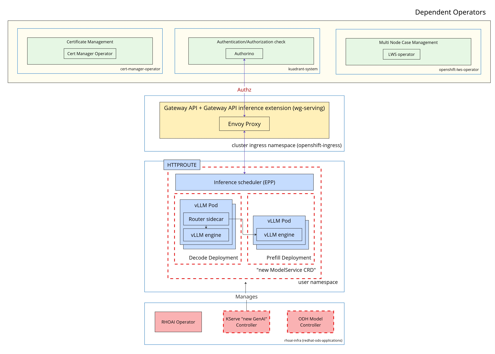

# OpenShift Setup for LLM Inference Service GA

The *LLM Inference Service* leverages the `Gateway API` together with the `Gateway Inference Extension` to manage routing, and uses the LWS Operator for multinode deployments. For authentication and authorization, it integrates Authorino from Red Hat Connectivity Link.

By default, all communication is encrypted (except between vLLM instances). The chosen Gateway API implementation provider is `OpenShift Service Mesh (OSSM) 3.1+`, which supports only Gateway API ingress functionality and does not include full mesh features.

In this setup, the Gateway API provides a standardized entry point, while Connectivity Link is used solely for authentication and authorization. Defining resources like `GatewayClass`, `Gateway`, `HTTPRoute`, and `AuthPolicy` up front makes the system easier to operate and more resilient.

The overall architecture is illustrated below.




## Prerequisites

### Cluster
- OpenShift Version: 4.19.9+

### Operators
- **Cert-Manager v1.17.0**: Certificate management for Kubernetes (required by LWS operator)
- **Leader Worker Set Operator v1.0.0**: Enables deploying pods as a unit of replication for AI/ML inference workloads
- **Red Hat Connectivity Link v1.1.1**: Provides a control plane for defining connectivity-related policies like TLS, authentication/authorization, rate limiting, and DNS routing / multi-cluster routing.

*Create Script*
~~~
oc apply -k ./docs/samples/llmisvc/ocp-setup-for-GA/prerequisites/dependent-operators
~~~

*Verify commands*
~~~
# Wait for cert-manager to be ready
oc wait --for=condition=CatalogSourcesUnhealthy=false subscription/openshift-cert-manager-operator -n cert-manager-operator --timeout=300s

# Wait for Leader Worker Set Operator to be ready
oc wait --for=condition=CatalogSourcesUnhealthy=false subscription/leader-worker-set -n openshift-lws-operator --timeout=300s

# Wait for Red Hat Connectivity Link Operator to be ready
oc wait --for=condition=CatalogSourcesUnhealthy=false subscription/rhcl-operator -n kuadrant-system --timeout=300s
~~~

### Required objects

*LeaderWorkerSetOperator*
```
oc apply -f - <<EOF
apiVersion: operator.openshift.io/v1
kind: LeaderWorkerSetOperator
metadata:
  name: cluster
  namespace: openshift-lws-operator
spec:
  managementState: Managed
  logLevel: Normal
  operatorLogLevel: Normal
EOF
```

*Kuadrant*
```
oc apply -f - <<EOF
apiVersion: kuadrant.io/v1beta1
kind: Kuadrant
metadata:
  name: kuadrant
  namespace: kuadrant-system
EOF
```


*SSL Authorino*
> **Note**: RHCL does not currently provide a way to configure SSL for Authorino, so SSL needs to be set up manually. This should be done after the Kuadrant CR has been created and is ready.

~~~
# Add `ServingCert` annoataion to Authorino Service
oc annotate svc/authorino-authorino-authorization  service.beta.openshift.io/serving-cert-secret-name=authorino-server-cert -n kuadrant-system

# Wait for creating the Secret
sleep 2

# Update Authorino to configure SSL
oc apply -f - <<EOF
apiVersion: operator.authorino.kuadrant.io/v1beta1
kind: Authorino
metadata:
  name: authorino
  namespace: kuadrant-system
spec:
  replicas: 1
  clusterWide: true
  listener:
    tls:
      enabled: true
      certSecretRef:
        name: authorino-server-cert
  oidcServer:
    tls:
      enabled: false
EOF
~~~


*Script*
~~~
oc apply -k ./docs/samples/llmisvc/ocp-setup-for-GA/prerequisites/required-objects

./docs/samples/llmisvc/ocp-setup-for-GA/prerequisites/ssl-authorino/config-ssl-authorino.sh
~~~

*Verify commands*
~~~
oc wait --for=condition=ready pod -l control-plane=controller-manager -n openshift-lws-operator --timeout 150s

oc wait --for=condition=ready pod -l authorino-resource=authorino -n kuadrant-system --timeout 150s
~~~


## Next steps
---
- [Deploying a model by using the Distributed Inference Server with llm-d [Developer preview]](https://access.redhat.com/articles/7131048)
- [Quick Start - Deploy Your First LLM Inference Service](../getting-started/01-quick-start/)

